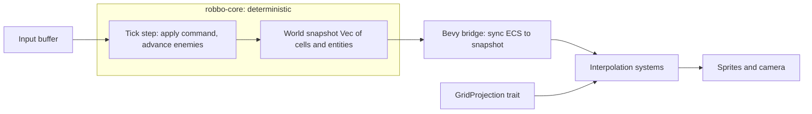

# DigitalRobbo — GNU Robbo Remake (Rust + Bevy) Specification & Plan

## 1. Vision & Non-Negotiables
- Faithful puzzle/enemy logic of GNU Robbo (RobboVI = original 56 levels + packs).
- Smooth, interpolated tile-to-tile movement and clean animations (the thing the old Cocos2d-x remake got awkwardly).
- Architecture decoupled enough that a **top-down 2D** view ships first and an **isometric 2.5D** view drops in later with **zero changes to game logic**.
- Original `.dat` level packs parse and play unchanged.
- Targets Desktop + Web + Mobile (mobile is the riskiest in Bevy — treated as first-class but validated last).

## 2. Stack
- Engine: **Bevy 0.18.x** (latest), ECS-first.
- Language: Rust (stable). `cargo check` always; remember to `unset ARGV0` before cargo.
- Workspace crates (clean separation is the whole point):
  - `robbo-core` — pure Rust, **no Bevy dependency**. Deterministic simulation: grid, entities, tick step, command application, win/lose. Fully unit-testable headless.
  - `robbo-formats` — parse/serialize gnurobbo `.dat` packs into `robbo-core` levels.
  - `robbo-app` — the Bevy front-end (rendering, input, audio, UI, asset pipeline). Bridges `robbo-core` state to ECS visuals.
- Persistence: `serde` + RON/JSON; web uses browser localStorage via `bevy`-friendly storage shim.
- Build/deploy: native cargo; `wasm-bindgen` + `trunk` for web; mobile via Bevy's Android/iOS templates.

## 3. Core Architecture — the key idea
The original game is **turn/tick based**: a move is an instantaneous grid jump. The smoothness problem is solved by separating *logical state* (discrete, deterministic) from *visual state* (continuous, interpolated).



- **Deterministic core tick**: `World::step(command) -> Vec<Event>`. Robbo and enemies resolve on the same tick model as the original (enemies move every N ticks, Robbo moves on input). No floats in logic; positions are `(col,row)`.
- **Events**: the core emits a typed event stream (`Moved{entity, from, to}`, `Pushed`, `Shot`, `Collected`, `Died`, `Teleported`, `Exploded`). The view layer consumes events — this is the **Observer pattern**.
- **Visual interpolation**: each visual entity stores `from_cell`, `to_cell`, `progress: f32`. Render transform = `lerp(project(from), project(to), ease(progress))`. When `progress` reaches 1.0 the next buffered command may commit. Input buffering keeps it responsive without breaking determinism.
- **GridProjection trait** is the isometric seam:

```rust
pub trait GridProjection {
    fn cell_to_world(&self, cell: Cell, layer: f32) -> Vec3;
    fn sort_key(&self, cell: Cell) -> f32; // depth sort for iso
}
```

`TopDownProjection` ships v1; `IsometricProjection` is added later. Logic and animation code never reference pixels directly.

## 4. Design Patterns (mapped to Bevy)
- **Command pattern (undo/redo)**: every player action is a `Command`. `robbo-core` supports `step(cmd)` plus state snapshots (cheap clone of the grid) for undo. Undo = restore prior snapshot + replay-free visual reset.
- **State machine**: app-level `bevy_state` (`Boot -> MainMenu -> LevelSelect -> Playing -> Paused -> LevelComplete -> GameOver`). Entity-level micro-states (`Idle/Moving/Pushing/Dying`) drive animation selection.
- **Observer**: core `Event` stream → Bevy `EventWriter`/`MessageWriter` → animation, audio, particle systems react.
- **Object pool**: projectiles, explosion/teleport particles use a recycled pool (spawn/despawn churn avoided), important for WASM/mobile.

## 5. Level Format & Compatibility (`robbo-formats`)
GNU Robbo `.dat` packs are INI-like sections + an ASCII grid. Confirmed structure (from `robbo01.dat`):
- Header keys: `[name]`, `[last_level]`, `[default_level_colour]`, `[offset]`, then per level: `[level]`, `[colour]`, `[size]` (`16.31` or `32.31`), `[author]`, `[level_notes]`, `[data]` followed by the grid rows.
- Tile legend (from `tools/LevelFormats.txt`): `R`=Robbo, `O/o`=walls, `-`=black wall, `Q`=red wall, `T`=screw, `'`=bullet/ammo, `#`=box, `%`=key, `b`=bomb, `D`=door, `?`=questionmark, `@`=bear, `^`=bird, `!`=capsule, `+`=life, `H`=ground, `*`=black bear, `V`=butterfly, `&`=teleport, `}`=gun, `M`=magnet, `~`=push box, `=`=barrier.
- **Caution / required validation**: real `.dat` files in the wild use additional/variant chars (e.g. `robbo01.dat` uses `s` for walls). The parser MUST be validated against gnurobbo's actual loader (`screen.c`), not just `LevelFormats.txt`. Plan: vendor a copy of the gnurobbo source as reference, port the exact char→tile mapping, and round-trip every shipped pack as a test.
- Parser produces a `Level { width, height, colour, tiles: Vec<Tile>, entities: Vec<EntitySpawn>, required_screws, ... }`.

## 6. Game Element Catalog (logic parity)
Must replicate exactly: Robbo (move/push/shoot 4-dir), walls (several visual types, same collision), screws (collect, count toward goal), capsule (exit when enough screws collected), bombs (chain explosions), doors+keys, bears (clockwise/anti-clockwise wall-followers), birds (patrol/firing variants), butterflies, black bears, guns (laser/blaster/regular, fixed/rotating/moving, directional), magnets, boxes vs push-boxes, teleports (numbered mirror pairs), questionmarks (reveal item/bomb), ground, energetic barrier. Each becomes a `robbo-core` component + a tick behavior; enemy AI ported from original to guarantee solvability.

## 7. Rendering, Animation, Camera
- Tile-based sprite rendering via `bevy` sprites + texture atlases.
- Animation principles: 60 FPS target; eased move tween (~120-160ms/cell, tunable); push = Robbo + box share one tween; shoot = arm-extend frames + pooled projectile; teleport = fade-out/in; explosion = pooled particle burst.
- **Camera**: fit-level-to-viewport with letterboxing for fixed-size levels; smooth follow for larger 32-wide levels; integer/▿pixel-perfect scaling option for crisp pixel art. Camera reads world coords from the active `GridProjection`, so it works for both top-down and iso.

## 8. Asset Pipeline (swappable, data-driven)
- A **skin manifest** (RON): maps logical tile/entity/state → atlas region + animation frame list + timing. Swapping skins or adding animations = editing the manifest, no code changes.
- v1 sources: reuse assets from the old Cocos2d-x remake (`DigitAdventures`) where usable + curated free assets; keep one consistent palette (the supplied Robbo Blue / Rust Brown / Deep Space scheme). gnurobbo's GPL skins kept as a fallback/reference.
- Directory: `assets/skins/<name>/skin.ron` + atlases. Iso skin later is just another manifest with iso-sized art.

## 9. UI / Screens
Main menu, pack/level select (grid with completion status + later thumbnails), in-game HUD (screws collected/required, ammo, keys, timer), pause, level-complete, settings (remappable keys, colourblind palette, grid overlay, audio). Bevy UI.

## 10. Persistence & Modern Features
- Progress + per-level completion + best times (RON file native; localStorage on web).
- Undo single move (puzzle helper) via command/snapshot.
- Speedrun timer. Optional "modern mode" toggle reserved for any intentional rule tweaks (off by default for fidelity).

## 11. QA / Validation
- `robbo-core` unit tests for every element: movement edge cases, push (wall/multi/corner), shooting (range/collisions/directions), collection counting, all death types, teleport mirror pairs, undo/redo multi-step.
- **Solvability harness**: scripted/known solutions or a checker that asserts no soft-locks and capsule reachability across all original levels.
- Round-trip parse test for every shipped pack. Determinism test: same command sequence → identical snapshot hash. No-leak check via pool sizes. Cross-platform smoke (native + WASM at minimum per CI).

## 12. Architecture Design Documentation (FIRST deliverable — living docs)
Before any code, create a documentation set under `docs/architecture-design/` that is the evolving source of truth. It is updated at the end of every milestone (each milestone's "definition of done" includes updating the relevant doc). Docs are plain Markdown with embedded Mermaid so they version with the code.

Files to create:
- `docs/architecture-design/README.md` — index/table of contents, how to read and how to keep docs current (the "update docs every milestone" rule), doc status legend.
- `01-overview.md` — vision, goals, non-negotiables, system context (C4 Level 1 context diagram), quality attributes (fidelity, smoothness, portability, testability), constraints.
- `02-architecture.md` — C4 container/component view of the three crates (`robbo-core`, `robbo-formats`, `robbo-app`), dependency rules (core has NO Bevy dep), data-flow diagram (input → tick → snapshot → bridge → interpolation → render), and the layering boundaries with what is allowed to depend on what.
- `03-core-simulation.md` — deterministic tick model, `World::step(command) -> Vec<Event>`, coordinate system `(col,row)`, no-float-in-logic rule, snapshot/clone strategy for undo, determinism guarantees + how they're tested (snapshot hash).
- `04-view-decoupling.md` — THE key seam: `GridProjection` trait, `from_cell`/`to_cell`/`progress` interpolation model, why this makes top-down→isometric a drop-in, what code is forbidden from touching pixels, camera contract.
- `05-design-patterns.md` — Command (undo/redo), State machine (`bevy_state` + entity micro-states), Observer (core Event stream → Bevy events), Object pool (projectiles/particles); each with where it lives and a small code/struct sketch.
- `06-level-format.md` — gnurobbo `.dat` section/grid spec, full tile legend, the LevelFormats.txt-vs-real-files caveat, parser output model (`Level`), validation/round-trip strategy.
- `07-element-catalog.md` — table/list of every game element, its logical behavior, tick rules, and parity notes vs original; kept in sync as elements are implemented.
- `08-assets-skins.md` — skin manifest (RON) schema, logical-name → atlas/animation mapping, how to swap skins / add animations, iso-skin forward plan, palette.
- `09-ui-and-states.md` — screen flow state diagram, HUD contract, settings/accessibility.
- `10-persistence.md` — save model, native (RON) vs web (localStorage) abstraction, progress/best-times schema.
- `adr/` — Architecture Decision Records (one file per decision, e.g. `0001-use-bevy.md`, `0002-deterministic-core-no-bevy-dep.md`, `0003-topdown-first-iso-later.md`, `0004-all-three-platforms.md`); short context/decision/consequences format. Seed with the decisions already made in this plan.
- `glossary.md` — domain terms (cell, tick, snapshot, projection, skin, pack, screw, capsule, etc.).
- `diagrams/` — source for any larger diagrams (Mermaid inline preferred; this holds exported/large ones).

Conventions: every doc has a status header (Draft/Stable) and a "last updated (milestone)" line; Mermaid follows the no-spaces-in-node-ids rules; no markdown tables where bullet lists suffice for diff-friendliness.

## 13. Milestones / Roadmap
- M-DOC Architecture docs scaffold (above) — done first, then evolves continuously.
- M0 Skeleton: workspace, Bevy window, state machine, CI (`cargo check`/test, wasm build).
- M1 Core sim headless: grid, Robbo move/push, screws, capsule, walls, win condition + tests. No rendering.
- M2 Parser: load `original.dat`, validate against gnurobbo source mapping, round-trip tests.
- M3 Top-down render + interpolation: TopDownProjection, sprite bridge, eased movement, camera fit, placeholder art.
- M4 Full element parity: all enemies/guns/teleports/bombs/etc., skin manifest + real assets, audio, particle pools.
- M5 Shell & polish: menus, level select, settings, persistence, undo, timer.
- M6 Platforms: web build + mobile validation.
- M7 (stretch): isometric IsometricProjection + iso skin; level editor.

## 14. Open Decisions to Confirm Later (not blocking)
- Exact move duration / input-buffer feel (tune in M3).
- Whether to ship a 16x16 and a larger tile atlas (gnurobbo supports both) or single resolution.
- Level editor scope (stretch).