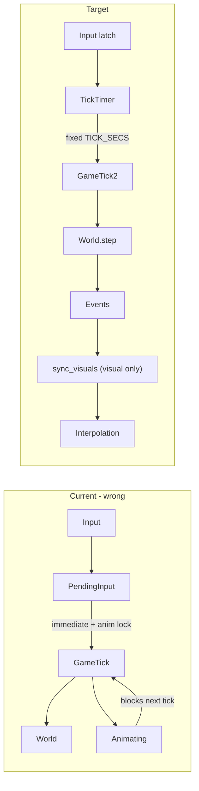
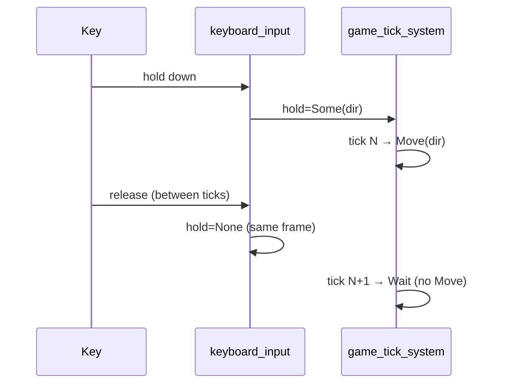
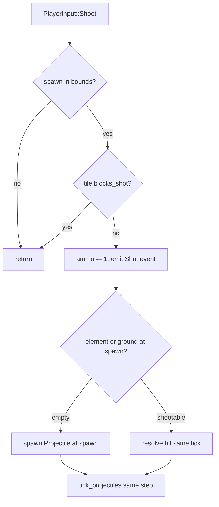

# Fix Robbo Steering (Logic vs Animation)

## Problem summary

Two separate issues cause the "hard to move one field" feel:

1. **Wrong steering semantics** — [`input.rs`](crates/robbo-app/src/input.rs) treats every key-down as `Move(dir)` via `pressed()`, with instant visual turn on `just_pressed` but no sim-level turn-only action.
2. **Logic gated by animation** — [`bridge.rs`](crates/robbo-app/src/bridge.rs) blocks `game_tick_system` while `bridge.animating == true`, and [`buffer_input_while_animating`](crates/robbo-app/src/bridge.rs) queues moves until the tween finishes. This couples simulation to visuals (which you correctly flagged as wrong).



---

## Target behavior (your spec)

| Input | Result |
|---|---|
| Brief tap, **same** direction as facing | **One** `Move` on the **next sim tick** |
| Brief tap, **different** direction | **Turn only** (immediate), **no** move that tick |
| Hold (after first frame) | `Move` every sim tick while key is down |
| Release | Clear hold latch on release frame; **no `Move` on subsequent ticks** (stop is tick-aligned, not animation-aligned) |
| Space | `Shoot` on **next sim tick** |
| Turn toward adjacent bomb/ground/box/wall, then shoot | **Yes** — turn does not require a free cell; shot resolves on the **first cell in front** on the shoot tick |

Turn is immediate (visual + sim facing for shooting). **All moves and stops are tick-aligned** (~7 Hz via `TICK_SECS` in [`bridge.rs`](crates/robbo-app/src/bridge.rs)). Animation is visual-only and never affects whether a tick fires or what input is consumed.

**Shooting adjacent targets:** Robbo can face a wall or object without moving into it, then fire on the next tick. The shot hits whatever occupies the first cell in `last_direction` — destroying ground, exploding bombs, breaking boxes, etc. — in the **same sim tick** as `Shoot` (projectile spawn + `tick_projectiles` in one `world.step()`).

---

## Part 1 — Decouple simulation from animation

### 1a. Stop blocking ticks on animation

In [`game_tick_system`](crates/robbo-app/src/bridge.rs):
- Remove `if bridge.animating { return; }`
- Remove immediate step on `has_player_input` and `tick_timer.reset()` on input
- **Only** call `world.step()` when `tick_timer.just_finished()`

World/enemies/bullets/player all advance at fixed rate regardless of tween progress.

### 1b. Remove animation-driven input queue

Delete or gut:
- [`buffer_input_while_animating`](crates/robbo-app/src/bridge.rs)
- [`release_queued_input`](crates/robbo-app/src/bridge.rs)
- `queued_input` field on `CoreBridge`
- `bridge.animating` as a gameplay gate (keep only if needed for visual debug; interpolation should not block logic)

Remove their registration from the chain in [`lib.rs`](crates/robbo-app/src/lib.rs).

### 1c. Make interpolation purely visual

In [`interpolation.rs`](crates/robbo-app/src/interpolation.rs) and [`render.rs`](crates/robbo-app/src/render.rs):
- Always advance `VisualMotion.progress` every frame (remove `if !bridge.animating` guard)
- On new `Moved` event while a tween is in-flight: retarget motion from **current interpolated cell** (or snap `from` to latest world cell) to new `to` — prevents visual pops when logic outruns animation
- `sync_visuals` continues to run on each tick's events; no dependency on `animating`

### 1d. Input gating during animation (UI only)

In [`input.rs`](crates/robbo-app/src/input.rs), remove `if bridge.animating { return; }` for one-shot actions (undo/shoot/pause). Only keep countdown block.

---

## Part 2 — Steering state machine

Add a small resource (either extend `CoreBridge` or new `SteeringState` in [`input.rs`](crates/robbo-app/src/input.rs)):

```rust
pub struct SteeringState {
    /// Direction key currently held (updated every frame from pressed/released)
    pub hold: Option<Direction>,
    /// Latched one-step move from tap-same-direction (consumed on next tick)
    pub tap_move: Option<Direction>,
    /// Latched shoot (consumed on next tick)
    pub shoot_pending: bool,
}
```

### Keyboard handling ([`input.rs`](crates/robbo-app/src/input.rs))

Per direction key, each frame:

1. **`just_pressed(dir)`**
   - If `dir == facing_direction` → `tap_move = Some(dir)` (one step next tick)
   - Else → **turn immediately** (see Part 3), do **not** set `tap_move`

2. **`pressed(dir)`** (ongoing hold) → `hold = Some(dir)`

3. **`just_released(dir)`** → if `hold == Some(dir)`, set `hold = None` (and clear `tap_move` if it matches). Input latch clears on the release frame; **sim stops on the next tick** because `hold` is already `None` when `game_tick_system` evaluates.

Remove the current pattern that sets `bridge.pending_input = Move(dir)` every frame from `pressed()`.

### Release semantics (tick-aligned stop)

Everything in sim runs on tick boundaries — including stopping:



- **On release frame:** clear `hold` immediately so no future tick sees a held direction.
- **On next tick:** `game_tick_system` finds no hold → `PlayerInput::Wait` → Robbo stops stepping.
- **No post-release ghost step:** remove `queued_input` / animation-buffered moves entirely (Part 1b).
- **No mid-tick rollback:** if a tick already fired `Move` this interval before release, that step stands; release only prevents **future** ticks from moving.

This matches classic Robbo: release means "don't walk on the next tick," not "freeze mid-tween."

### Tick consumption ([`game_tick_system`](crates/robbo-app/src/bridge.rs))

On each `timer_fired` tick, derive **one** `PlayerInput` with priority:

```
1. shoot_pending  → Shoot(last_direction)
2. hold dir       → Move(dir)   // only if key still held (pressed && !just_pressed semantics handled via hold latch)
3. tap_move       → Move(dir)   // consume latch once
4. else           → Wait
```

**Hold repeat rule:** movement from hold fires only on ticks where `hold` is set at tick evaluation time. Clearing `hold` on `just_released` ensures the **next** tick does not move.

**Tap different direction:** turn happens in input immediately; no `Move` latched → no move that tick.

---

## Part 3 — Sim-level turn (for shooting direction)

Add to [`PlayerInput`](crates/robbo-core/src/events.rs):

```rust
Turn(Direction),
```

Add `turn_robbo(dir)` in [`world.rs`](crates/robbo-core/src/world.rs):
- Update Robbo `ElementState.direction` in place
- No `Moved` event, no position change

For **immediate** turn (not waiting for tick), call from `keyboard_input` via a thin helper:

```rust
fn turn_robbo(bridge: &mut CoreBridge) {
    world.turn_robbo(dir);           // sim facing
    bridge.facing_direction = dir;
    bridge.last_direction = dir;     // shoot uses this
}
```

Alternatively: call `world.step(PlayerInput::Turn(dir))` synchronously in input (outside tick timer). Prefer direct `turn_robbo` helper to avoid polluting tick history/undo.

Update [`update_robbo_sprite`](crates/robbo-app/src/render.rs) — already reads `facing_direction`; no change needed.

---

## Part 4 — Shoot on next tick

Change Space handling in [`input.rs`](crates/robbo-app/src/input.rs):
- `just_pressed(Space)` → `steering.shoot_pending = true` (do **not** set `pending_input` immediately)
- Tick system consumes it once → `PlayerInput::Shoot(bridge.last_direction)`

---

## Part 6 — Fix `try_shoot` for adjacent targets (current bug)

**Your expectation is correct.** Turn-toward-object + shoot is valid Robbo gameplay. The steering plan (turn without move) only works if shooting also works into the adjacent cell.

**Current bug** in [`try_shoot`](crates/robbo-core/src/world/movement.rs):

```rust
if !self.in_bounds(spawn) || self.is_blocked(spawn) {
    return;  // ← rejects almost all adjacent shots
}
```

`is_blocked(spawn)` is true when the front cell has:
- a **wall tile** (`blocks_movement`)
- **ground** tile (`H` — also `blocks_movement`)
- a **bomb, box, screw**, etc. (non-walkable element)

So today you often **cannot shoot at all** when facing the thing you want to hit. This is separate from the steering FSM and must be fixed in core.

### Target `try_shoot` logic



1. **Reject only** out-of-bounds or `tile.blocks_shot()` (solid walls, doors, barriers) — not `is_blocked()`.
2. **Spend ammo** and emit `GameEvent::Shot`.
3. **If spawn cell has a shootable target** (bomb, box, ground tile, question mark, enemy, etc.): apply the same hit rules as [`tick_projectiles`](crates/robbo-core/src/world/projectiles.rs) **immediately** (explode, destroy ground, remove pair, etc.) — no need to spawn a projectile into an occupied cell.
4. **If spawn cell is empty** (walkable empty tile): spawn projectile at `spawn`; `tick_projectiles` runs later in the same `world.step()` and advances it.

### Wall-facing edge case

- **Solid wall** (`blocks_shot()`): shot is blocked; no ammo spent (matches “can’t shoot through wall”).
- **Turn toward wall** is still valid (steering turn-only); shoot simply no-ops on next tick.

Extract shared helper e.g. `resolve_projectile_hit(at, from_player, events) -> HitResult` used by both `try_shoot` (instant hit on spawn cell) and `tick_projectiles` (hit on `next` cell) to avoid duplicated match logic.

### Tests to add

- Robbo adjacent to bomb, facing bomb, `Shoot` → bomb explodes same tick, ammo −1
- Robbo adjacent to ground tile, `Shoot` → ground destroyed same tick
- Robbo adjacent to solid wall, `Shoot` → no effect, ammo unchanged
- Turn toward bomb without move, then shoot on next tick (integration with steering FSM)

---

## Part 5 — Tests and harness updates

- Update [`test_harness.rs`](crates/robbo-app/src/test_harness.rs): `is_animating()` should no longer gate movement waits; wait for tick count or cell change instead
- Add unit/integration tests for steering:
  - Tap same dir → exactly 1 cell after N ticks
  - Tap different dir → 0 cell change, facing updates
  - Hold 3 ticks → 3 cells (if unblocked)
  - Release mid-hold → no Move on ticks after release (tick-aligned stop)
  - Space → shot on next tick only

---

## Files to change

| File | Changes |
|---|---|
| [`crates/robbo-app/src/input.rs`](crates/robbo-app/src/input.rs) | Steering state machine, turn helper, remove `pending_input` spam |
| [`crates/robbo-app/src/bridge.rs`](crates/robbo-app/src/bridge.rs) | Tick-only stepping, remove anim gate + queue systems |
| [`crates/robbo-app/src/lib.rs`](crates/robbo-app/src/lib.rs) | Remove buffer/release systems from chain |
| [`crates/robbo-app/src/interpolation.rs`](crates/robbo-app/src/interpolation.rs) | Always advance tweens; remove animating clear |
| [`crates/robbo-app/src/render.rs`](crates/robbo-app/src/render.rs) | Retarget `VisualMotion` on rapid moves |
| [`crates/robbo-core/src/events.rs`](crates/robbo-core/src/events.rs) | Add `PlayerInput::Turn` (optional if using direct helper) |
| [`crates/robbo-core/src/world/movement.rs`](crates/robbo-core/src/world/movement.rs) | Fix `try_shoot` adjacent-target logic |
| [`crates/robbo-core/src/world/projectiles.rs`](crates/robbo-core/src/world/projectiles.rs) | Shared `resolve_projectile_hit` helper |
| [`crates/robbo-app/src/test_harness.rs`](crates/robbo-app/src/test_harness.rs) | Adjust wait logic |

---

## Risk note

Once logic ticks faster than tweens complete, Robbo may visually "slide" or catch up. That is intentional per your separation requirement. Retargeting `VisualMotion.from` on each new move keeps it smooth rather than snapping.
