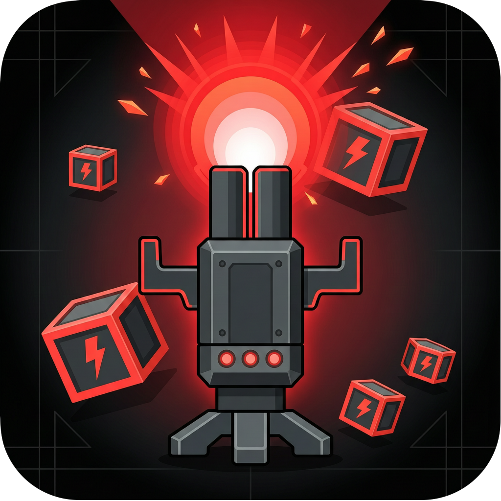

# DigitalRobbo

<p align="center">
  
</p>

A small remake of the classic puzzle game **Robbo**, written in Rust with [Bevy](https://bevyengine.org/). It is not meant to replace anything — just a personal attempt to bring those levels to more screens, with touch controls on Android and a browser build for WASM.

**[Watch a short gameplay video →](https://youtu.be/SSQ8WgN_zac)**

## Standing on open source

Robbo was created by **Janusz Pelc** for the Atari platform. Years later, the **[GNU Robbo](https://gnurobbo.sourceforge.net/)** project kept the game alive: open levels, open logic, and a community that still cares. DigitalRobbo would not exist without that work.

This project tries to honour that spirit. The simulation references GNU Robbo behaviour; level packs use the same `.dat` format. If you enjoy DigitalRobbo, please also look at GNU Robbo and the original game — they are the real foundation.

That is what open source makes possible: one person builds on another's work, and something old can find new players. I am grateful to Janusz Pelc for Robbo, and to everyone who contributed to GNU Robbo over the years.

## Crates

| Crate | Role |
|-------|------|
| `robbo-core` | Deterministic simulation (no Bevy) |
| `robbo-formats` | GNU Robbo `.dat` level parser |
| `robbo-app` | Bevy front-end (desktop, WASM, Android) |

## Build

```bash
unset ARGV0 && cargo check --workspace
unset ARGV0 && cargo run -p robbo-app
```

## Controls

| Input | Action |
|-------|--------|
| Arrow keys / WASD | Move |
| Space | Shoot |
| Z | Undo |
| Esc | Pause / back |
| Enter | Confirm menu |
| F9 | Toggle editor stub |

On Android, on-screen pads replace keyboard input (move on the left, turn and shoot on the right).

## Automated game smoke test

Headless end-to-end check: boot → skip intro → load level 1 → move Robbo → capture PNG screenshots.

```bash
chmod +x scripts/run_game_smoke_test.sh
./scripts/run_game_smoke_test.sh              # binary mode (writes target/smoke/*.png)
ROBBO_SMOKE_MODE=test ./scripts/run_game_smoke_test.sh   # integration test mode
cargo run -p robbo-app -- --smoke-test        # same scenario, manual run
```

Uses `xvfb-run` when available (CI and headless Linux). Logic tests remain in `robbo-core` / `robbo-formats` via `cargo test --workspace`.

## Web (WASM)

```bash
rustup target add wasm32-unknown-unknown
# Clear RUSTFLAGS if your system linker uses mold (breaks wasm-ld)
RUSTFLAGS="" trunk serve crates/robbo-app/index.html
```

## Android

Requires Android SDK + NDK (API 31+), `cargo-ndk`, and `ANDROID_SDK_ROOT` set.

```bash
chmod +x scripts/build_android.sh scripts/verify_assets.sh
./scripts/verify_assets.sh
./scripts/build_android.sh
adb install -r mobile/android/app/build/outputs/apk/debug/app-debug.apk
```

See [docs/mobile.md](docs/mobile.md) for install notes, touch controls, and troubleshooting.

### App icon

The launcher icon comes from [`assets/icon.png`](assets/icon.png) (1024×1024 source). After changing it, regenerate Android mipmaps:

```bash
./scripts/generate_android_icons.sh
./scripts/build_android.sh
```

## Mobile (iOS)

Not wired yet. See [docs/mobile.md](docs/mobile.md) when the time comes.

## Docs

Architecture design: [docs/architecture-design/README.md](docs/architecture-design/README.md)

## License

GPL-3.0-or-later — same family as GNU Robbo.
