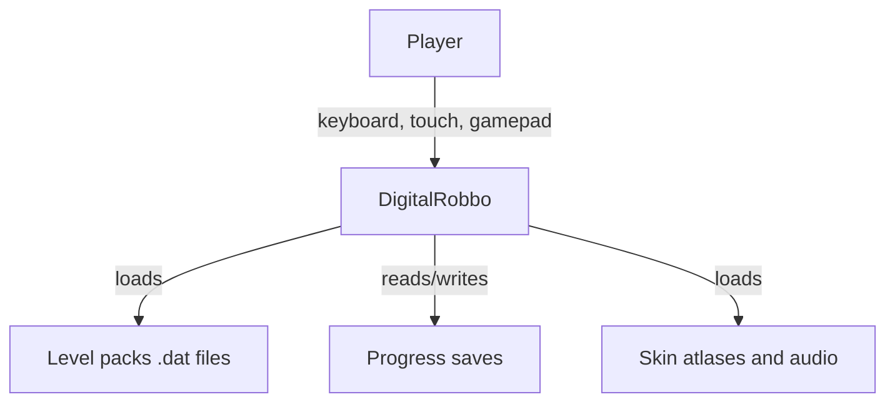

# 01 — Overview

> **Status:** Draft  
> **Last updated:** M-DOC

## Vision

Modern, polished remake of the classic 1989 Atari puzzle game **Robbo** (via the open-source clone **GNU Robbo**). Same puzzles and enemy behaviours; smooth tile-to-tile movement; clean architecture for long-term maintenance and a future **isometric 2.5D** presentation.

## Goals

- Play all original `.dat` level packs with faithful puzzle logic
- Smooth interpolated animations (walk, push, shoot, teleport)
- Engine-agnostic deterministic core (headless-testable)
- Top-down 2D first; isometric renderer swappable later without logic changes
- Cross-platform: Desktop, Web (WASM), Mobile

## Non-negotiables

1. **Fidelity** — puzzle rules and enemy AI match GNU Robbo unless an explicit optional "modern mode" is enabled (off by default).
2. **Determinism** — same inputs → same world state; no floats in simulation logic.
3. **Decoupling** — `robbo-core` has zero Bevy dependency.
4. **Original levels** — parse and play gnurobbo `.dat` packs unchanged.

## System context (C4 Level 1)

## Quality attributes

| Attribute | Target |
|-----------|--------|
| Fidelity | All original levels solvable; behaviour matches gnurobbo reference |
| Smoothness | 60 FPS; eased cell transitions ~120–160 ms |
| Portability | Native + WASM + mobile templates |
| Testability | Core fully unit-testable without GPU/window |
| Maintainability | Three-crate workspace; ADRs for major decisions |
| Extensibility | Skin manifest; GridProjection for render mode swap |

## Constraints

- **Stack:** Rust + Bevy 0.18.x
- **Core:** no Bevy in `robbo-core` or `robbo-formats`
- **Assets:** data-driven skin manifest; reuse DigitAdventures + curated free assets for v1
- **Palette:** Robbo Blue `#4A6B8A`, Rust Brown `#7D5C34`, Deep Space `#1A1A2E`, Energy Orange `#E67E22`, Bolt Gold `#F1C40F`, Danger Red `#E74C3C`, Green `#2ECC71`, Gray `#95A5A6`

## Out of scope (v1)

- Isometric rendering (M7 stretch)
- Built-in level editor (M7 stretch)
- Online leaderboards / multiplayer
