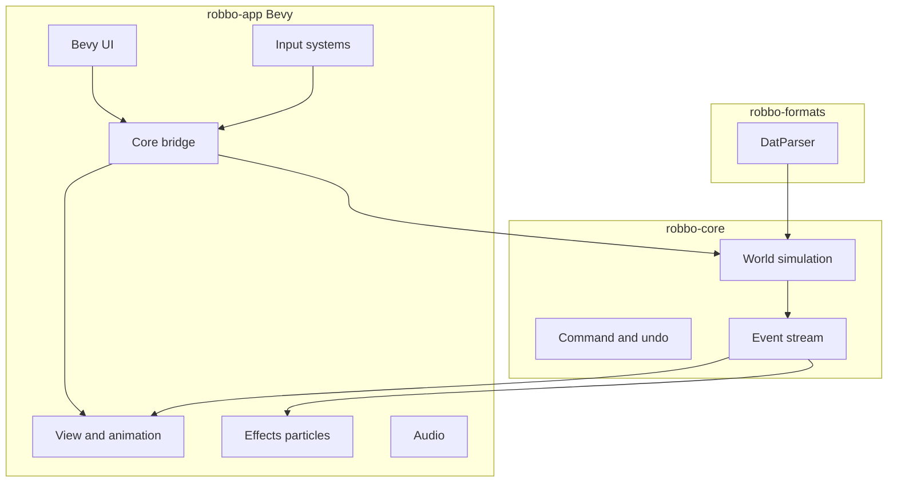
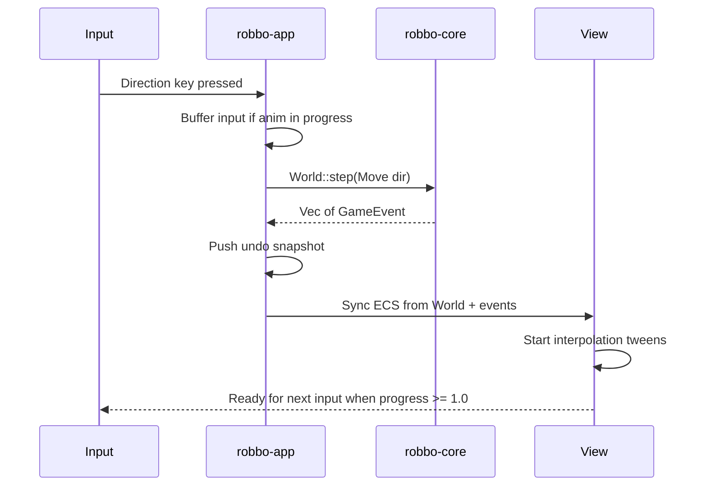

# 02 — Architecture

> **Status:** Implemented (M7 gap-closure)  
> **Last updated:** 2026-06-20  
> **Stack:** Bevy 0.15, Rust stable

## Workspace layout

```
digitalrobbo/
├── crates/
│   ├── robbo-core/      # Pure simulation (no Bevy)
│   ├── robbo-formats/   # .dat parser/serializer
│   └── robbo-app/       # Bevy front-end
├── assets/
│   ├── levels/          # original.dat, robbo01.dat (GPL packs)
│   └── skins/
├── docs/architecture-design/
└── .github/workflows/
```

## C4 containers



## Dependency rules

| Crate | May depend on | Must NOT depend on |
|-------|---------------|-------------------|
| `robbo-core` | std, serde (optional) | bevy, wgpu, windowing |
| `robbo-formats` | robbo-core | bevy |
| `robbo-app` | robbo-core, robbo-formats, bevy | — |

**Rule:** simulation logic never imports rendering types. Pixel/world conversion lives only in `robbo-app` behind `GridProjection`.

## Data flow (one player move)



## Layer boundaries

1. **Logic layer** (`robbo-core`) — grid, entities, tick, win/lose, AI
2. **Format layer** (`robbo-formats`) — bytes/text → `Level` → `World`
3. **Presentation layer** (`robbo-app`) — Bevy ECS, sprites, camera, UI, audio, [`effects/`](11-visual-effects.md) particles
4. **Data layer** — `.dat` packs, skin RON, save files

## App state machine (high level)

`Boot → MainMenu → LevelSelect → Playing → Paused → LevelComplete | GameOver`

Managed via `bevy_state`. See [09-ui-and-states.md](09-ui-and-states.md).
