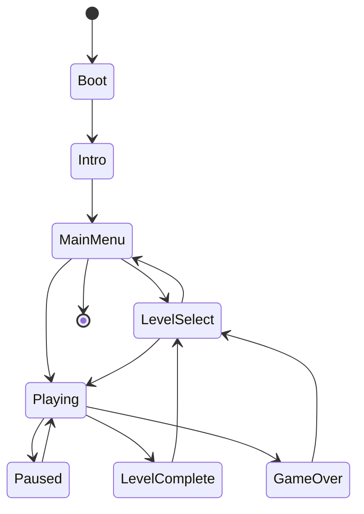

# 09 — UI and States

> **Status:** Implemented  
> **Last updated:** 2026-06-21

## Screen flow

## Screens

| Screen | Contents |
|--------|----------|
| Intro | Skippable logo sequence (every launch); any key skips |
| MainMenu | Visual menu (space/planet), START, SELECT LEVEL, mute |
| LevelSelect | Pack list → level grid, completion stars, best time |
| Playing | Game view + HUD + optional 3-2-1 countdown |
| Paused | Resume, Restart, Undo, Settings, Quit to select |
| LevelComplete | Stats, Next level, Level select |
| GameOver | Retry, Level select |
| Settings | Keys, audio, colourblind palette, grid overlay, skin |

## HUD contract

- Screws: `collected / required`
- Ammo count
- Keys held
- Speedrun timer (optional display)
- Pack / level name

## Input

- **Desktop:** arrow keys / WASD move; space shoot; Z undo; Esc pause
- **Main menu:** Up/Down navigate; Enter confirm; M mute
- **Intro:** any key skips to main menu
- **Web:** same + touch overlay (virtual D-pad)
- **Mobile:** on-screen D-pad + action buttons; remappable

## Accessibility

- Remappable keys
- Colour-blind friendly alternate palette (settings)
- Optional grid overlay for tile clarity
- Scalable UI text (`MarkerFelt.ttf`)

## Implementation

Bevy UI (`Node`, `Text`) + sprite layers for intro/menu. State transitions via `NextState<AppState>`.

**Intro:** `intro.rs` — timed text sequence or skip → `MainMenu`.

**Main menu:** `menu.rs` — background sprites, planet tween, keyboard menu.

**Level loading:** `LoadLevelEvent` triggers `load_level_system`. New levels run a 3-2-1 countdown (`LevelCountdown`); restarts skip it.

**Audio:** menu BGM on Intro/MainMenu; level BGM seeded from level content hash (see `audio.rs`).

**HUD:** persistent `HudText` entities updated each frame from `CoreBridge`.

**Overlays:** `spawn_menu_overlay` on LevelSelect, Paused, LevelComplete, GameOver.

**Input:** arrows/WASD move, Space shoots in `last_direction`, Z undo, X redo, Esc pause. Level select uses arrow keys + Enter.
