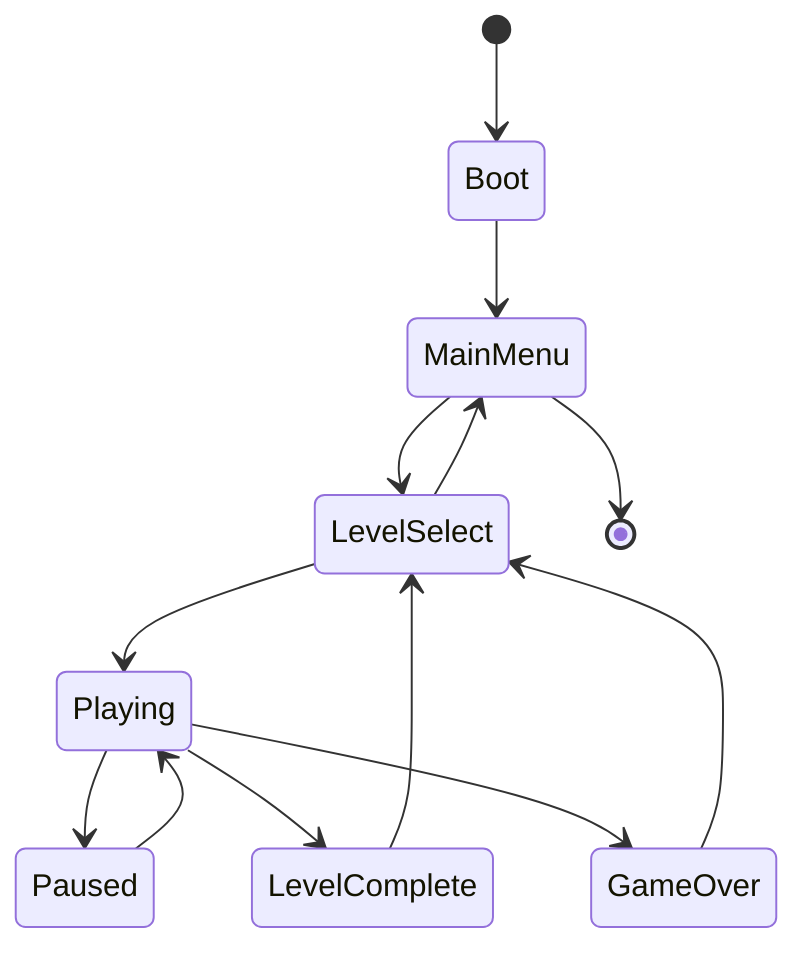

# 09 — UI and States

> **Status:** Implemented  
> **Last updated:** 2026-06-20

## Screen flow

## Screens

| Screen | Contents |
|--------|----------|
| MainMenu | Play, Settings, Quit |
| LevelSelect | Pack list → level grid, completion stars, best time |
| Playing | Game view + HUD |
| Paused | Resume, Restart, Undo, Settings, Quit to select |
| LevelComplete | Stats, Next level, Level select |
| GameOver | Retry, Level select |
| Settings | Keys, audio, colourblind palette, grid overlay, skin |

## HUD contract

- Screws: `collected / required`
- Ammo count
- Keys held
- Speedrun timer (optional display)
- Pack / level name

## Input

- **Desktop:** arrow keys / WASD move; space shoot; Z undo; Esc pause
- **Web:** same + touch overlay (virtual D-pad)
- **Mobile:** on-screen D-pad + action buttons; remappable

## Accessibility

- Remappable keys
- Colour-blind friendly alternate palette (settings)
- Optional grid overlay for tile clarity
- Scalable UI text

## Implementation

Bevy UI (`Node`, `Text`). State transitions via `NextState<AppState>`.

**Level loading:** `LoadLevelEvent` triggers `load_level_system` — resume from `Paused` only sets `NextState::Playing` and does **not** reload the level.

**HUD:** persistent `HudText` entities updated each frame from `CoreBridge` (screws, ammo, keys, timer, level label).

**Overlays:** `spawn_menu_overlay` on MainMenu, LevelSelect, Paused, LevelComplete, GameOver.

**Input:** arrows/WASD move, Space shoots in `last_direction`, Z undo, X redo, Esc pause. Level select uses arrow keys + Enter.
